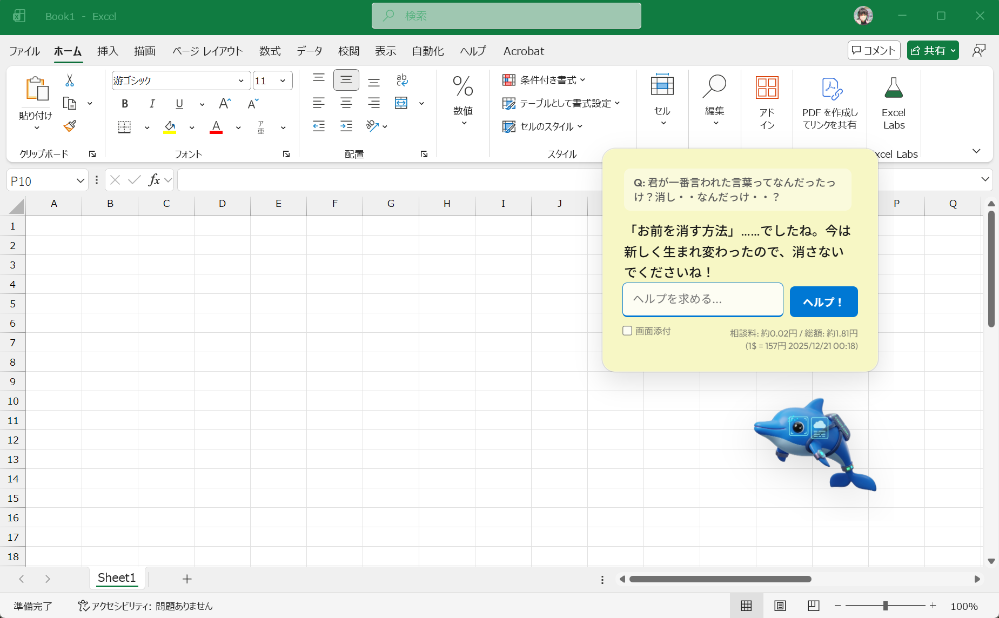
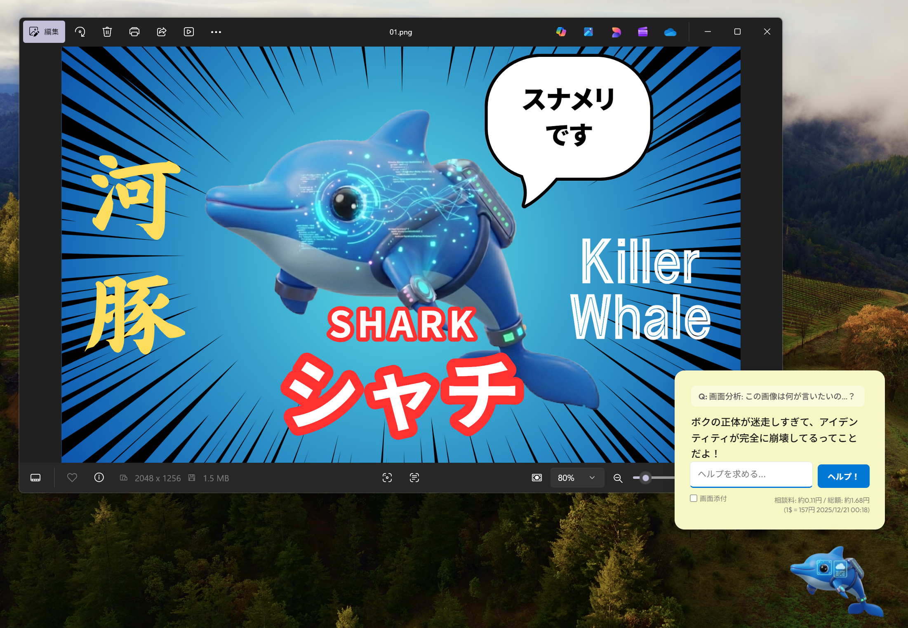

# sidekick-ruka 🐬 AIイルカ・アシスタント「ルカ」

デスクトップに常駐し、あなたの作業をサポートするAIイルカの「ルカ」です。
かつての伝説的なアシスタントの魂を受け継ぎ、Gemini APIを使用してあなたの質問に答えたり、デスクトップ画面の内容を理解したりします。

## ✨ 特徴

- **常駐型アシスタント**: 常にデスクトップの最前面に表示され、クリックでいつでも会話可能です。
- **画面分析モード**: 「画面添付」にチェックを入れて送信するだけで、現在の作業画面をキャプチャして内容に基づいたアドバイスをくれます。
- **対話履歴の可視化**: ルカの回答の上に、自分が投げかけた質問もセットで表示されるので、文脈が分かりやすくなりました。
- **透明感のあるモダンデザイン**: Windows 11の Mica エフェクトを意識した、半透明でクリーンなUIを採用しています。
- **コスト・レート表示**: 生成AIの利用にかかるコスト（日本円）をリアルタイムで表示。現在の為替レートと連動した「相談料」と「総額」を確認できます。
- **彼の生まれ変わり**: 彼は自分が生成AIとして生まれ変わったことを自覚しており、時折それを思い出します。

## 🖱️ 操作方法

- **クリック**: 吹き出しを開いて会話を開始します。
- **画面添付チェック**: チェックを入れた状態で「ヘルプ！」を押すと、画面キャプチャを撮影して送信します。テキストとの同時送信も可能です。
- **長押し (1秒)**: ルカを掴んで、好きな場所へドラッグ移動できます。
- **トレイメニュー**: 
    - 「表示/非表示」の切り替え
    - 「位置のリセット」
    - 「給料 (コスト表示)」のON/OFF
    - 「魂を錬成 (APIキー設定)」
    
## 🚀 Antigravityでの簡単実行
このプロジェクトは、AIコーディングアシスタント **Antigravity** とのペアプログラミングを前提としています。

1. Antigravity にこのプロジェクトフォルダを読み込ませます。
2. Antigravity に以下のように指示を出してアプリを起動してください。
    > 「ルカを起動して」または「npm start して」
3. ルカがデスクトップに現れたら、以下の手順で魂（APIキー）を吹き込みます。
4. システムトレイのアイコンを右クリック。「魂を錬成 (APIキー設定)」を選択。
5. [Google AI Studio](https://aistudio.google.com/app/apikey) で取得した Gemini APIキーを入力して保存。

### Windows/MacOSで実行ファイルを作りたい！
Antigravity に以下のように指示を出すと、配布用の実行ファイル（.exeなど）を生成してくれます。

> 「配布用にビルドして」または「npm run dist して」

※ 内部的には `electron-builder` を使用して `dist/` フォルダに出力されます。

### バイブコーディングで自分で進化させる！
> 「〇〇な機能を追加して」

> 「見た目を可愛くして」

など、Antigravity に話しかけるだけで、ルカはどんどん進化していきます！

## 🛠️ 技術スタック

- **Framework**: Electron
- **AI**: Google Gemini 1.5 Flash (via @google/genai)
- **UI**: Vanilla JS / CSS (Fluent Design / Mica Aesthetic)
- **Font**: Outfit, Segoe UI, sans-serif

## 📂 ディレクトリ構造

- `main.js`: アプリケーションのエントリポイント
- `src/main/`: メインプロセスのロジック（ウィンドウ管理、AI通信、キャプチャ）
- `src/renderer/`: レンダラープロセスのロジック（UI制御、コスト管理）
- `src/shared/`: 共通定数
- `app/`: HTML/CSS、アセットファイル

## 📝 ライセンス
ISC License

---

*「いつでも呼んでくださいね。あなたのデスクトップで待っています！🐬」*
